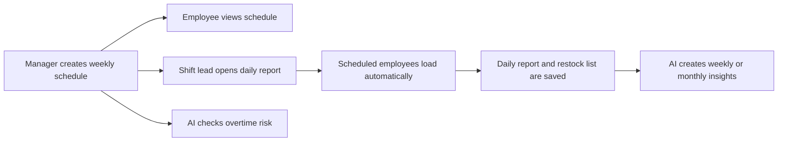
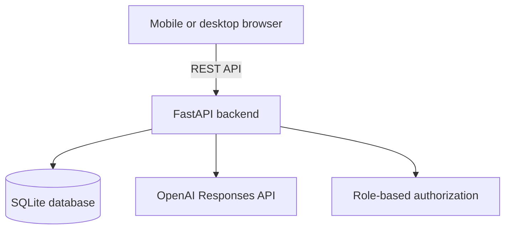

# Imperial Treasure — AI Restaurant Operations Assistant

> 宝藏餐厅运营助手：一款面向真实餐厅工作流设计的中英双语、移动端优先运营平台。

[](https://react.dev/)
[](https://fastapi.tiangolo.com/)
[](https://www.sqlite.org/)
[](https://platform.openai.com/)

[English](#english) · [中文](#中文)

---

## English

### Overview

Imperial Treasure is a full-stack restaurant operations platform built to replace fragmented scheduling, shift handoff, employee evaluation, and restocking workflows with one mobile-friendly system.

The product supports three distinct roles:

| Role | Access |
| --- | --- |
| Manager | Weekly scheduling, employee directory, overtime analysis, daily reports, restocking, and AI reports |
| Shift Lead | Daily operations reports, scheduled employee scores, attendance notes, and restocking |
| Employee | Schedule-only access to protect sensitive management information |

### Core features

- **Mobile-first weekly scheduling** — a color-coded schedule grid based on an actual restaurant roster format.
- **Schedule-to-report automation** — employees scheduled for a selected date are automatically listed in the shift report.
- **Flexible employee evaluation** — supports optional comments and decimal scores such as `4.8`.
- **Structured daily reporting** — captures roast duck quality, kitchen feedback, service timing, attendance, special events, and holiday notes.
- **Expandable restocking workflow** — packaging supplies, soup containers, takeout bags, paper products, drinks, and beer are organized into checkable drawers.
- **Persistent catalog management** — managers can add new beverage types from a phone and remove discontinued products.
- **AI operations summaries** — generates weekly or monthly management reports from saved operational data.
- **AI overtime guidance** — detects employees above the weekly threshold and recommends possible schedule changes.
- **Bilingual experience** — the interface and AI output switch between Chinese and English; employee and product names remain unchanged.

### Product workflow



### Product decisions

- Role permissions keep employee evaluations and operational reports private.
- Historical schedules and reports remain intact when an employee is deactivated.
- Daily employee names come from the schedule to reduce repetitive data entry and save time during closing.
- Restocking uses simple checkboxes instead of quantities to match the restaurant's actual ordering process.
- AI is used for summarization and decision support, while managers retain final control over staffing decisions.

### Technology

| Layer | Technology |
| --- | --- |
| Frontend | React 19, Vite, responsive CSS |
| Backend | FastAPI, Pydantic, Python |
| Database | SQLite |
| AI | OpenAI Responses API |
| Authentication | Role-based access codes supplied through environment variables |

### Architecture



### Run locally

Requirements: Python 3.10+ and Node.js 20+.

#### 1. Start the backend

```bash
cd backend
python3 -m venv venv
source venv/bin/activate
pip install -r requirements.txt
cp .env.example .env
uvicorn main:app --reload --host 0.0.0.0 --port 8000
```

Update `backend/.env` with private access codes. Add an OpenAI API key only if AI reporting is needed.

#### 2. Start the frontend

```bash
cd frontend
npm install
npm run dev -- --host 0.0.0.0
```

Open `http://localhost:5173`. A phone on the same Wi-Fi network can use the network address printed by Vite.

---

## 中文

### 项目简介

宝藏餐厅运营助手是一款根据真实餐厅工作流程设计的全栈产品，将员工排班、领班交接、员工表现、补货管理和 AI 运营分析整合到一个适合手机操作的平台中。

### 用户与权限

| 用户 | 可用功能 |
| --- | --- |
| 店长 | 排班、员工名册、加班分析、领班报告、补货管理、AI 周报与月报 |
| 领班 | 填写每日运营报告、员工评分、出勤记录和补货清单 |
| 员工 | 仅查看班表，无法查看员工评价和其他管理信息 |

### 核心功能

- 按周选择日期的彩色移动端排班表
- 领班报告自动读取当天班表中的员工姓名
- 支持 `4.8` 等小数评分，员工评价为选填
- 记录烤鸭、后厨菜品、前台出菜、出勤及特殊事项
- 包装耗材、饮料与啤酒使用下拉抽屉和勾选式补货流程
- 店长可在手机上新增或删除饮料种类，并永久保存
- AI 自动生成中文或英文周度、月度运营总结
- AI 检查员工工时并提供加班风险和排班调整建议
- 中英文界面选择保存在当前设备中

### 产品价值

- 减少领班每天重复填写员工姓名的时间
- 将分散的排班、日报和补货信息统一保存
- 通过角色权限保护员工评价与内部运营数据
- 将每日记录转化为可执行的管理建议
- 为店长提供更清晰的员工工时和运营趋势视图

---

## Privacy and repository safety / 隐私与仓库安全

This public portfolio repository excludes all production data and credentials. The following files are intentionally ignored:

- Production SQLite databases
- Real employee schedules, names, and evaluations
- Manager, shift-lead, and employee access codes
- OpenAI API keys and `.env` files
- Virtual environments, dependencies, and build output

本公开仓库仅用于作品展示，不包含真实员工信息、运营记录、访问密码、数据库或 API Key。

## Project scope

This project demonstrates end-to-end product ownership across workflow research, information architecture, responsive product design, permission modeling, full-stack implementation, persistent data storage, and applied AI reporting.

---

Built as an independent product project by [Aaronwuuu](https://github.com/Aaronwuuu).
